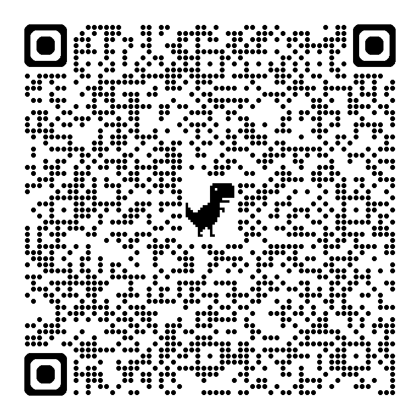
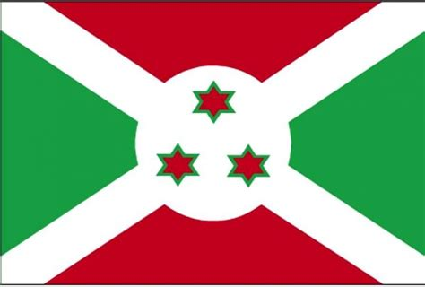
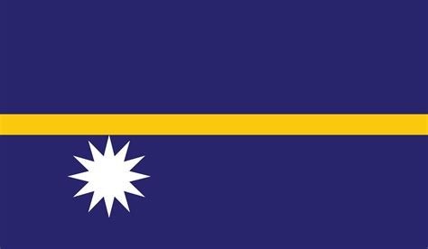
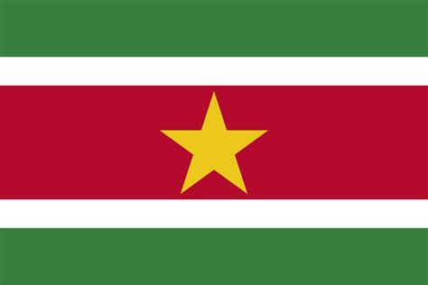
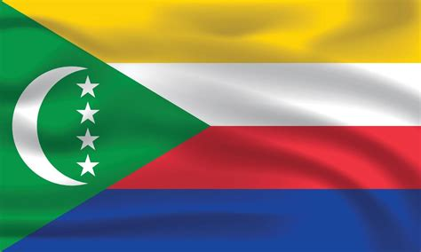

Verónica, necesitamos tu ayuda!! Nos han pedido que resolvamos unos problemas y no tenemos ni idea de cómo empezar.
Sabemos que tú eres la persona adecuada para este trabajo, así que lo dejamos en tus manos. La mecánica parece bastante sencilla. Hay 7 problemas a resolver. El resultado de cada uno de ellos es una secuencia de caracteres. Además nos han dejado una utilidad para verificar si hemos acertado (`python check.py <puzzle_number> <solution>`). No sabemos qué hay que hacer con estos caracteres. Por favor, ayúdanos!!!!

# Puzzle 1 
from_ascii(100 + f(key))

**keys** = `William Henry Harrison`, `Andrew Johnson`, `James Buchanan`, `James Monroe`

# Puzzle 2
 + .com

# Puzzle 3 - Enredo de letras

|**e** | **d** | **i** | **5** | **@** |
|---|---|---|---|---|
|**r** |**k** |**z** |**3** |**1** |
|**u** |**i** |**8** |**0** |**j** |
|**t** |**1** |**9** |**9** |**s** |
|**@** |**2** |**y** |**1** |**h** |


# Puzzle 4 - Quién falta?

<table>
  <tr>
    <td></td>
    <td></td>
  </tr>
  <tr>
    <td></td>
    <td></td>
  </tr>
</table>


# Puzzle 5
bytes.fromhex("6E49647465732D").decode()

# Puzzle 6 - ¿Está usted de broma, Sr. Feynman?

- 131 - 8 - 7 - 2
- 104 - 3 - 6 - 1
- 276 - 1 - 2 - 1
- 436 - 4 - 6 - 6
- 90  - 3 - 7 - 2
- 286 - 5 - 9 - 4
- 159 - 2 - 1 - 1

# Puzzle 7
```
hacer puzzles siempre estimula la mente y despierta la curiosidad.  
una mente curiosa encuentra caminos donde otros ven muros.  
quizás lo más divertido es descubrir la solución paso a paso.  
todos los acertijos esconden secretos que esperan ser revelados.  
incluso los desafíos más simples pueden enseñar grandes lecciones.  
zambullirse en ellos con entusiasmo convierte el juego en aventura.
```

# Puzzle 8 
Enhorabuena Verónica!! Has llegado hasta el final. Has resuelto todos los problemas... 
Siento defraudarte.  Un quiz no es digno de serlo si no mide tu conocimiento de
banderas del mundo.

<table>
  <tr>
    <td align="center">
      <strong>1</strong><br>
      
    </td>
    <td align="center">
      <strong>2</strong><br>
      
    </td>
    <td align="center">
      <strong>3</strong><br>
      
    </td>
  </tr>
  <tr>
    <td align="center">
      <strong>4</strong><br>
      
    </td>
    <td align="center">
      <strong>5</strong><br>
      
    </td>
    <td align="center">
      <strong>6</strong><br>
      
    </td>
  </tr>
</table>

```python

def substitute_last(password, value):
    parts = password.split("-")
    parts[-1] = value
    return "-".join(parts)

def first_letter(x):
  return x[0]

def flatten(table):
    return [cell for row in table for cell in row]

substitute_last(
  pwd,
  "".join(map(str.lower, map(first_letter, flatten(🏳️))))
)
```
